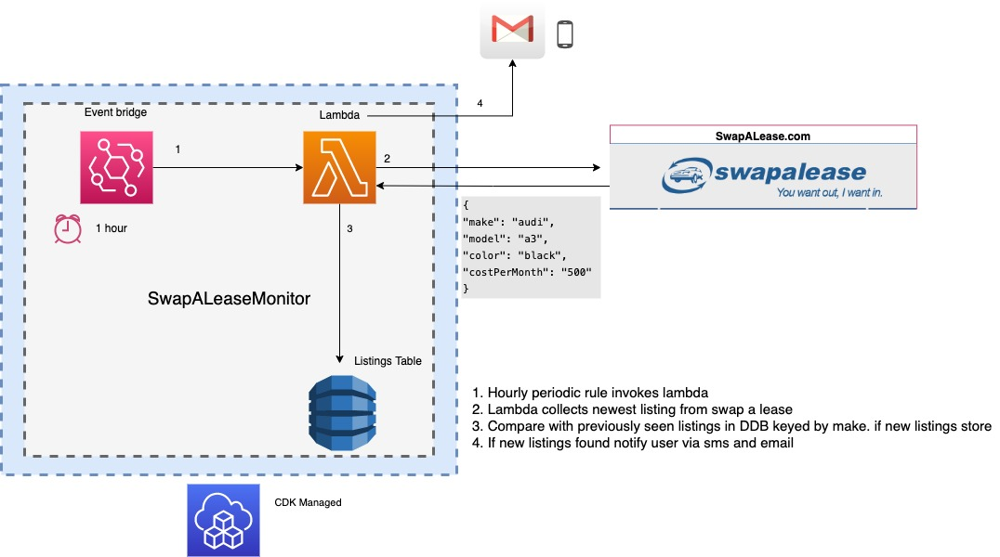

# SwapALeaseMonitor CDK

This packages contains the infrastructure for the SwapALeaseMonitor.

The SwapALeaseMonitor is a construct which periodically will scrape the newest lease transfer listings 
for SwapALease.com based on configurable parameters such as price, make, desired length and etc. 

It will store the listings in s3 and on eachj subsequent run the monitor will compare freshly retrieved 
listings with those it had previously seen. If new entries are discovered it will send and email 
to subscribers to inform of the new transfer opportunity. 

Optionally, the monitor can be congfigured to watch for "high value" listings and if discovered will
send a sms message to consumers.
